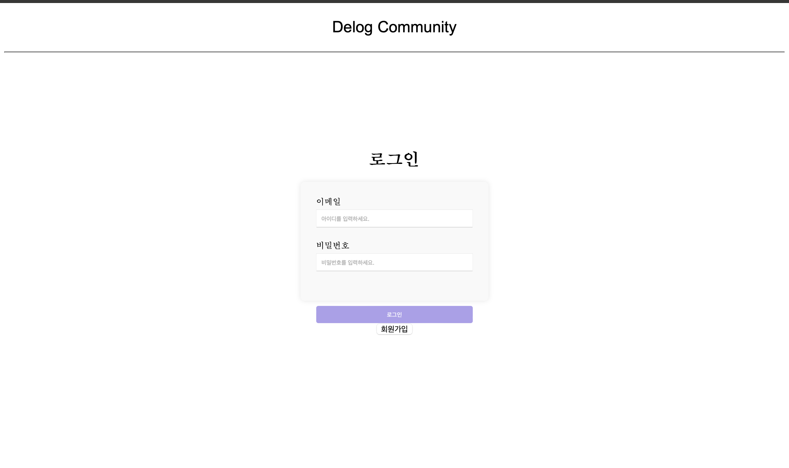
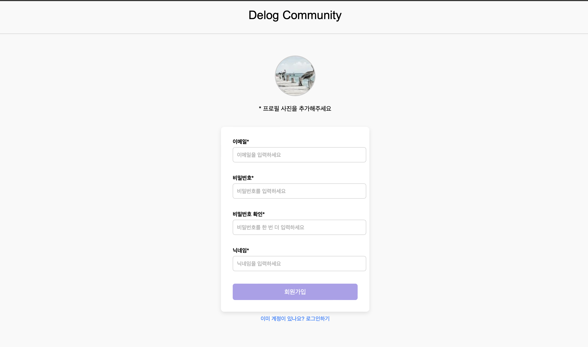
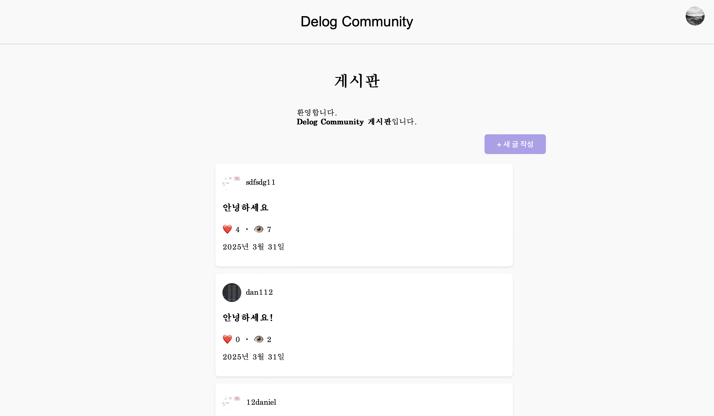
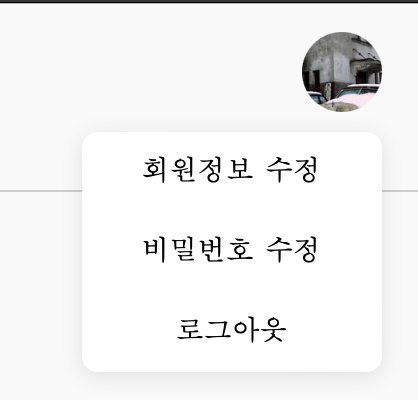
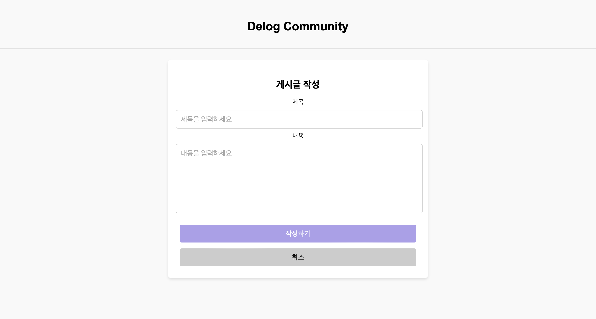
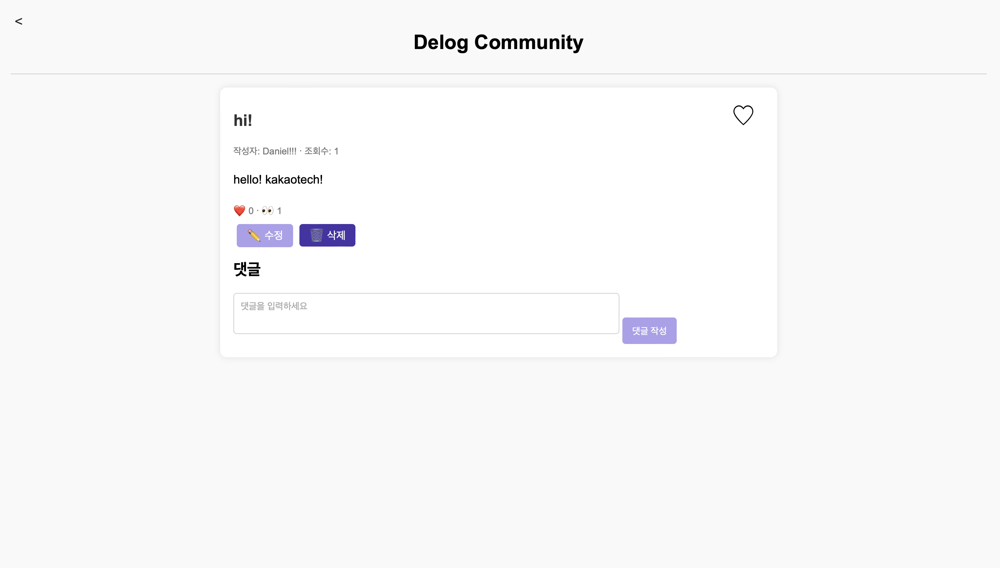
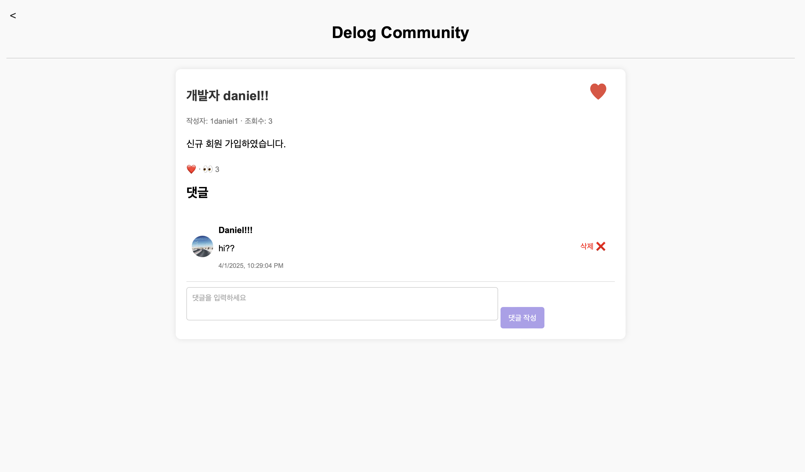
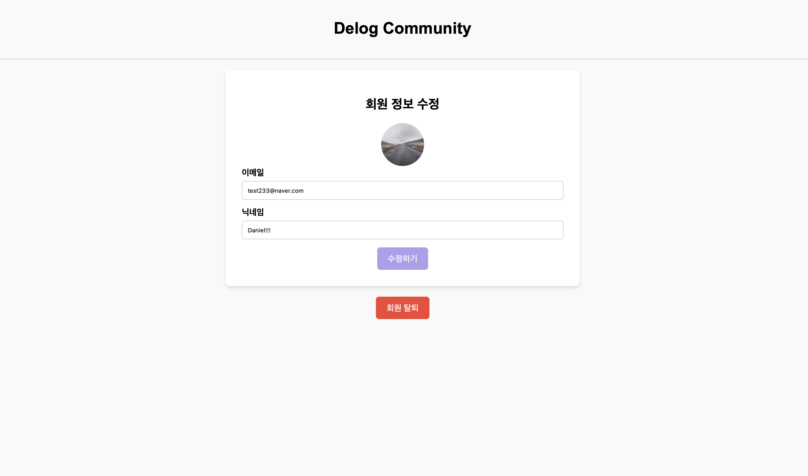
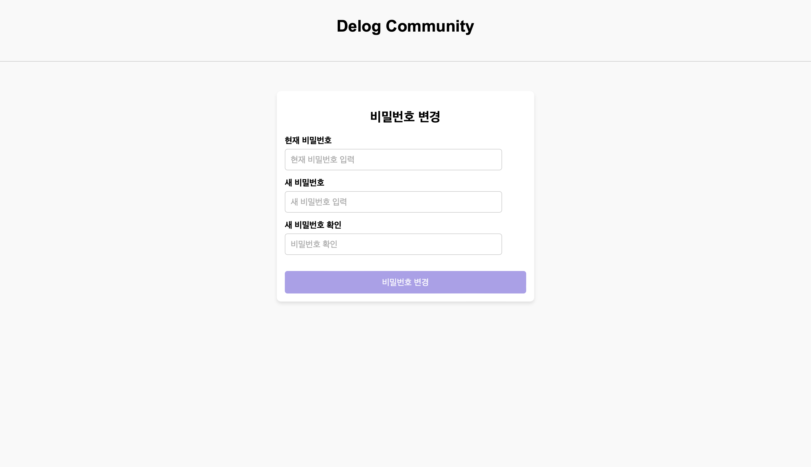

3 week homework

# Post Board
  사용자는 회원가입 후, 게시물을 작성할 수 있다.
  서로의 게시물을 볼 수 있는 community이다.

# 🔑 회원가입 및 로그인

현재는 프론트엔드만 구현해놓았기 때문에 users라는 배열에 담겨있어,

웹페이지를 새로고침할 때마다 정보가 초기화되지만

추후 FastAPI 백엔드에서 bcrypt를 사용한 비밀번호 해싱 및 검증

SQLite를 이용한 회원 정보 저장 및 관리할 예정입니다.

# 📝 게시판 기능

게시글 작성, 수정, 삭제

게시글 목록 및 상세 보기

조회수, 좋아요, 댓글 기능

## 💻 주요 화면

### 🔐 로그인 화면

### 🧾 회원가입

### 🏠 초기화면 (게시글 목록 & 프로필)

### ✍️ 게시글 작성

### 🛠 게시글 수정

### 💬 댓글 & ❤️ 좋아요

### 👤 회원 정보 수정 (프로필 이미지 & 닉네임)

### 🔒 비밀번호 변경

---

## 🧩 기술 스택

| 영역 | 사용 기술 |
|------|-----------|
| 프론트엔드 | HTML, CSS, JavaScript (Vanilla JS) |

---

## 🔄 향후 개선 사항 (To-do)

- 정적 html이 아닌 동적으로 만들기
- SPA로 개발해보기

---
